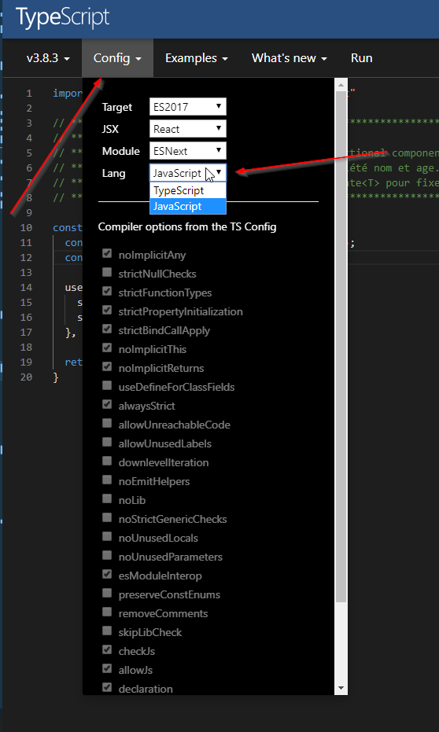
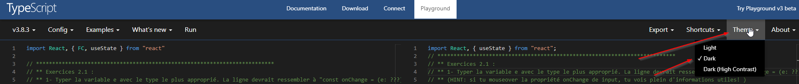

<h1>Formation TypeScript</h1>

Formations pour les développeurs React d'expérience qui commencent avec TypeScript

[**Présentation**](#) |
[**Exercices TypeScript**](#exercices-typescript) |
[**Exercices TypeScript React**](#exercices-typescript-react) |

---

:wave: La formation est donné par @alexandre.asselin et @macadam. N'hésitez pas à les poker sur Slack si vous avez des questions ou commentaires. :+1:

---

# Exercices TypeScript

5 exercices dans la sandbox [ici](https://codesandbox.io/s/typescript-exercises-78jy3) 

#  Exercices TypeScript React

## Setup pour les exercices

### Convertir le playground JavaScript en TypeScript

Lorsque vous ouvrez un exercice, la première chose à faire est de changer l'environement JavaScript en TypeScript. Ça simule le comportement que vous verrez lorsque vous convertisser un fichier .jsx en .tsx.

### Mettre le playground en Dark Mode

Tu le mérites

## Basic

### Function Components et leurs Props

*Exercice 1.1 : Migration d'un functional components*
- Lien vers l'exercice : [ici](http://www.typescriptlang.org/play/?jsx=2&useJavaScript=true#code/JYWwDg9gTgLgBAJQKYEMDG8BmUIjgIilQ3wG4AoUSWOAbzgGcYpgA7AcwBo4AjCCADbdMAV1ZpuEHgCskGOAF842XATA4wAWhgBPMEgb5y5APQm4AKivWbtu-YeOnzh6fNW4AUQAeSKGmA0AzgARgA6ELgALjg3SwtQzUQkcAF0PzgABQB5AGUASQAVfOyAOTgwFCg4MTgkVhEQOI8AJiSAYQhWADc-GGBqwv4BfrA61jg0XEhWevhCvSRctBYweBRetBrZuDYYP0x0iogRaoZg9QgwBjgACkqbngMINjgAEyRJrvOoXuqBC4abSLBgASmaCQAzElCjgRH93sFdPobmABCIbigwJd1MAAJfHU5wAGojSoiAMYD9Lp1eBMHQAiFwAAsSWQqXS-2CH0OIhGmTJsTM8RcorF4olVmMU1YTCyeSKJXKAF46OQ4Bq4DArnBVfhCtlMvhOOrNXwYNq8HqAELZQoGgCyxtNGoBmHgeoAMp4AGKFZ2auAsdgACw9BAQ+QA4gAJf3kJTS77wHELFG6tWByCU6msGJMFgcE2B-beGD55hsdhhYAMZAARxEAyQb2LmvpAJiUlkGBrdaQjebrZdcG6teAPE7vGGfYbTaIw8DXQdJ3O2T+MVE4gTSdl8B5KD5MAFVxuqtoI+zVOANNVOQKxTKYW1YDbGrHlMnn1VzBESBNCi7nKQyCKMGa3PQV65twpYwNwHb-qO45fpIrArhiSDrhkCigrqAB8maagC8BoGkDAMKUKAgMEqofhOAJwAA-AQ+DRAQbysGQI4MAA7lSaAhncUE3qwuEXoGgZoCg5zyg+SrPlcUQjhJmqkdJFFUcEADUeovpoAAMRgqSpPBECgADWFDGZM0mfPeipPualpKdZklkRp1E3DpBBObgBlGa5GqmaglnKaptmyQ5pRhG65ZhSpankZRnlwN5+Cxf58UScFFlWcZUkyfZj7RcGYYuYFkzucl2l6qVMCZRVvBmaFgaASORAwKcEy3FlAA8bzAN0lXqdVyq0IlHkGEoCFjQhSjLqumF-GNC0YVhUAKHhWWBrQsGAdZvUmAN3RbYGoIUG1IEjMAYBhKmIIZvdKIUFdoxhAeR4ntcGYffyZIUMY5BAA)
- Lien vers la solution: [ici](http://www.typescriptlang.org/play/?jsx=2&ssl=1&ssc=1&pln=48&pc=2#code/JYWwDg9gTgLgBAJQKYEMDGMA0cDecBiAwnAL5wBmUEIcARFKhrQNwBQrA9B3AFR-8DBQ4SNFjxIztz5wAogA8kUNMDRIAznACMAOi1wAXHCm8e2gLSIk4ADbolcAAoB5AMoBJACrvnAOThgKFBwAK4AdnBIYSEgJjIATJaEEGEAbkowwMGeEBA2mWCREWjUkGFR8J4AnmBIrmhQwGDwKOlooeVwwGEwSuT2ARAhweoaAVRgmgAUgZoARhoQ3XAAJkhwJWGjUOnBNmNgE+YwNRoAlHFmAMyWnlQhu6tjJ7WaYDYhmihghxCHwABLwbDOD7N4TN4QdTATIpSLwdQnfaXOAAFksyFs9j2YzW-RC+UcEOMXFMEnJFMpVL47CiMScbi8Pn8OFYcHZcBgfzgAF46J5nI5aJg2Ry5hAYFyaHzaAAhZyeAUAWWFovZ+3I8BlABlZPhPKqOXBGgBzAAWWroCHcAHEABIG1hkdjdXpQfpqOA5PIFIl-TS4NWDaGwsIAfiMLg83j8bCNvXkMCMiMaYRNcY5iKq+yMyHQMB0hFcrj9tVgwA0GfZqWA0Lm+wjcHFeVQYSrcBSSqGo2cuzDUzORlSSxWbBI7E2iK9uXyTSMRAAPN7Z2BS+oAHy8uBTPCQEPAOF8qNMvw6LlgbAJrBwLP7bA1uv7LcwKAhJDYTvdpC9hwkM68zdWSNfZ4DQOx1HUXwUBAMY+QfYB63WMM6FoQw6BWMIWCDdQAHcYTQM1tz3GEDzCf8gKNDk0BQUYGWjZkzz+Awg0oqjwMg6CxgAahlc9zAABloFjWKbBgUAAa3bI1qNo48Y18HRxUlahmJEyiwJojiYM0Hi6CUqUBKEtSjTmMTJOE9kZPWOSGI1JMLPU9ioO0uBdNoOzDIckyzKkqiaOsxl5J0U0LVU4zLKczidJlEKYE88L2VM1BzKNccgwYGBhgiKYHIXFZgFSDZIpgnkcA0iDnI0MhbyQUqarIT9Pm-XZSsantdhIdcvI5HAr3HNSFw4fLUi6o0zjHIA)

### Forms and Events

*Exercice 2.1 : Event Handler #1*
- Lien vers l'exercice : [ici](http://www.typescriptlang.org/play/?jsx=2&ssl=1&ssc=1&pln=20&pc=3&useJavaScript=true#code/JYWwDg9gTgLgBAJQKYEMDG8BmUIjgIilQ3wChSB6CuAKjvocaeZdbfZcurrgFEAPJFDTA0SAM5wATADoAjHABccLrRpw5AWjgAVAJ5ghcADYo4ANxRRgKAEbGkcRynNI0JxzAOOHcMMYBXSRQwMBww4ABLmVUeKW1kAHMrABMjUzhxCECYYAgAOyd4cWAPOC9DODQACwhgEqdxeBTgTExIonyYABo4KEjMY0ia4Cg4AAOqxwBHANKJeF8QYCQA-jgUlHzJMSqUcRiqNQ4T07PzunI0Aqa4AFk9ADFoPABeOAAKAEo4V4A+OAAb1IcFBVRu8GqWxSDgAygFbMt4O9HP8gSCwZikDIwkhXF0ACJITAoALGGDfADcGNBAF9yJiiDAAlBCh8aWCADyYF5wArwxHAGCvQFQ-IwpACpG0v4czGc4D5MABeAVJCvfAwJD8GD4OAUWWY0Gcig8qAgQ1gr7U+mgoA)
- Lien vers la solution: [ici](http://www.typescriptlang.org/play/?jsx=2&ssl=1&ssc=1&pln=20&pc=3#code/JYWwDg9gTgLgBAJQKYEMDGMA0cDecBiAwtgMoCeAdjABZIzBoCiAbklXAL5wBmUEIcAERRUGQQChxAeilwAVAsVLlK1WvUbNa6bIVxGADyRQ0DJAGc4AJgB0ARjgAuODvly4dgLRwAKmTDGcAA2KHDMKFDAKABGQUhw8SisaMHxMP7xcXBgQQCulihgYHzFwACXNq56Vt7IAOYRACaBIXDmEHn0EBQJ8ObAqXDpAXBo1BDA-Qnm8I3A3NxlIlTYUGXcQWVjwFBwAAej8QCOuQMW8FkgwEi5BnCNKBSWaPFoKOaVMm5aP79--wpJGhujM4ABZMj4aAgZxEOAAXjgAAoAJQIgB8uHEcBxoxB8Goj0acRIuWiV3giKRSGc5CotHoTFYVDR8MxOGxuK5SBsxSQzJgABEkNwULkgjBUQBuTk4jiSLkiGC5KA9JGy3EAHm40Lg3VJ5OAMHhOEJFGJSANFI46I1XM1wAoYFy8GGSHhghgSAMMEEcCktq5OM1Uh1UBAgdxKJl8pxQA)

*Exercice 2.2 : Event Handler #2*
- Lien vers l'exercice : [ici](http://www.typescriptlang.org/play/?jsx=2&useJavaScript=true#code/JYWwDg9gTgLgBAJQKYEMDGMA0cDecCuAzkgMowoxJwC+cAZlBCHAERSoYsBQXA9L3ABUwkaLHiJkqdJmS+A4XACiADyRQ0wNEkJwATADo9cAFxx5QwXACMAWjgAVAJ5h1cADYo4ANxRRgKABG7lRUKN5IaB5UMC5UIXBg7kRwKGBgjBnAAJcGcAAyXu7AAOYAdlQAJkjeUCjA8OyExCDBbgAH5vyWrGgQZYTw-QDCABYoZSVUALxwABRIZgD8KwCUcNMAfLjc3cIWivMAEgCSAHIOZoTAcDD4cCAQREgQEVAeXhkQWdkw2XAjcaTKpUYBlMD4LC3e7eCDAXRJJBguCVADkYLo0BAFGA-V0kOAIUIAEI4KsDoIKfp7Cd3HAnKkCBVUpD2PQUABz-ooqrZNCedjvfBlOA1JBleBAyohKB5ZAwYCC6K3OIo7J0ME3JIpcaQ7BIGBU26MfBvZWxVypCJRTxwQhOCXjNR2-DAXwSqhmFh9AZDMpjCZTZYrDaijbbHC7BSyGOxuPxkQ8H2DOAAQXSobm6y2uC4cHzcGT8AA2pQVFDiDAHEhywBdUPPMgUJBzFgsVYAbh4BcLeL9AeBoZmEbzPYLler5YWBjQ+Cg7AlDj8UxgBl8ySQndH+eoXe3cHYdygIrm+-zAB5Km7NmeC2X4AAyB9wc9giHwC1IaYse8sHwoDdphwe9aEBQMvxwMDgVoXgbzHF9eCvbw4ILLdqFHIA)
- Lien vers la solution: [ici](http://www.typescriptlang.org/play/?jsx=2#code/JYWwDg9gTgLgBAJQKYEMDGMA0cDecBiAwtgK4DOSAyjCjEnAL5wBmUEIcARFKhpwFD8A9ELgAqCZKnSZsufIWK5w0RLgBRAB5IoaYGiRk4AJgB0xuAC44K8WLgBGALRwAKgE8wOuABsUcADcUKGAUACMfenoUAKQ0X3oYT3pIuDAfcjgUMDA2XOAAS9M4ABl-H2AAcwA7egATJACoFGB4HjIKEAjvAAObETsuNAhqsngRwgALFGrK+gBeOAAKJGsAfg2ASjh5gD5cAQGJWzVlgAkASQA5V2syYDgYEjgQCHIkCFioX39ciHyCjACnAJtNZvV6MBqmASFhHs8AhBgEZ0kgoXA6gByKHMaAgWjAEZGWHASJkACEcE2JzENJMLguPjg7iycBItSysJ4LBQAHORhj6gU0H4eN92XBGkhqvAwXVIlBisgYMAxQlHskMQVmFCHulMtNYdgkDA6Y82CQvuqkl4srF4n44GR3DLptonSRgEEZfRrJxhqNxtUpjM5usNjtJTt9jhDqolAnE0nk5JBAGxnAAII5axESNLbZ7XD8OCluDp+AAbTomjhFBgriQtYAupH3tRaEglpxOJsANyCMvlolBkPg-OrRC8GCmfB49SxGUAHjOrgAsiULtDYepIiBpTBdoWYyWh2X643aytTGgSFAeDLXME5jOghkkP3T6WGAOv3ABhWILBmCYZTugM5zlAIALgeZwzPKOgruum7bjAu5IPuMr7IsCwnkOAxDheTYwNet73geT5QC+phviQH4Dvhog-oOZY8E8UDVMsf6lkudRers3FljW8AAGQiXAS5QjC8A2kg8ycMJnCBCg77zDgwlMKCoZyTgWngkwQgCWeElCHxARGWWn4MKeQA)

### Hooks

*Exercice 3.1 : useState et useEffect*
- Lien vers l'exercice : [ici](http://www.typescriptlang.org/play/?jsx=2&ssl=1&ssc=1&pln=20&pc=2&useJavaScript=true#code/JYWwDg9gTgLgBAJQKYEMDGMA0cDecCuAzkgMowoxLZFICiAZvUhnAL5z1QQhwBEUqDLwBQwgPRi4AKhmy58hYqXKVqpeMky4tAB5IoaYGiSE4AZgB0ARjgAuOBulS4VgLRwAwhAB2AN30wwFBwADZIcGjckN5I3vC6KOBhcAAHBN4c+N4YwD4oIRFRPrHwMACeYACXjloATO4eAvrp4cBx+vTo4QCqxMEo-mihJnBgXGPAlTCVcN7ccEjwKADmSBY1zmbu+IEhwH2hKBw+OT5wy5XelVDAAI744QAm4TRkFEgAPAAqAHyjEPhgvRgHpgiEAOT6ASAuCEGHJYgwXr6DZqNHojGYmSiSLeQjxHSJMDJAC8cAAFDhvIkqHAVkhWABKOAkv44YRwQp4+AAbX2ABkIChno9sIiAJKEQXCpCPAC6LIIxDelHJnRCxEZAG4HJzcfi4DyaFAxYtkVAFWTXuRVd58CEQozRJyaAwmBhyeTmazcBzObCzX1KbMadh6WxtX7ORKpUKReSAIQCuOyyOc1jYHn07DUkC05My+VOv0CGCAjJ2h1a4SsIA)
- Lien vers la solution: [ici](http://www.typescriptlang.org/play/?jsx=2&ssl=1&ssc=1&pln=30&pc=2#code/JYWwDg9gTgLgBAJQKYEMDGMA0cDecBiAwtgK4DOSAyjCjEqRQKIBmzSGcAvnM1BCHABEUVBkEAocQHopcAFQLFS5StVr1GzWumyFcRgA8kUNMDRIycAMwA6AIxwAXHB3y5cOwFo4hCADsAN2MYYCg4ABskODR+SD8kP3hDFHBIuAADuBI-HmyMYH8UcOjY-wT4GABPMABL1z0AJm9CEWMs+LhgRONmdCiAVQowlCC0CIs4MD4p4BqYGrg-fjgkeBQAcyQbevcrbxIQ8OAhiJQef3z-OHWavxqoYABHEiiAEyjyKho6AB4AFQAfJMICQwsxgEYwuEAOTGESguBkBFpCgwQbGHZaLHYnG4hSSLp0KC9cxwdFhHDiOCLFJIZxkGAPPzrTBUuAbOmLEggABGxlZnAJ3WJfX0BhSYEiAAVppY8Gy-LT6Yyuiy2RznH5uXyoALJDE-AyxRLIs4iD9kqkkDKIGAyECALxwAAUOEVIHo7M2nAAlHAHUDKdSDUaANrHAAyEBQ71e2FRAEkyFGY0hXgBdf1ZCjUWhIZ29cIUH0Abhcwf8Yc+usRq3Jmadn1zv3JcAAPlzwuEAc6tV2fZJqZ8WGwMM7nX6A7g2dTUeTXTSPdgOVxSzPazAkynY86AISR6OxtfUzjYUMc7Duz0H1MZgdskQwUE5PvhEviThAA)

## Intermédiaire

### Function Components et leurs Props

*Exercice 1.2 : type union et ...extraProps*
- Lien vers l'exercice : [ici](http://www.typescriptlang.org/play/?jsx=2&ssl=1&ssc=1&pln=34&pc=2&useJavaScript=true#code/JYWwDg9gTgLgBAJQKYEMDG8BmUIjgIilQ3wG4AoUSWOAbzgCMIIAbAGjggDskB5TOAF842XATA4wAWhgBPMEgDO+cuQD0auACoduvfoOGjxk6aPrNOuAFEAHkihpgaJXACMAOgBMcAFxwLbS13KTgAYW4ANwcYYCg4ACEAVxgYbjgkeABZWQjwbiQueEK4ADEkrgxgbjzIHiKPAI0guFapdoA+OF4uOB44BSgQTIGURTgAEwByFAArCBSHSdcJCAlgAEuYDfGUFKI4AEckpDhI4EVgBhZTkbkFOAADuBYp4CKHTHRTiZXJRQ8gSsbU6cAAqrEWBclhUCPdThVqlx8AMFvEbuNIigbkl4oMQNDxmAUPF4UDgiCpF0ACo4JLReJoXDDIpweHo04eLlERTwVr8gWtclwLyhHpwRQoYDwY6nG5wanyH6nfDwlFKeATDazZ5azDvYCTFBccbIdAwDzJVLcAAS1KyABkAIKpKBXRaKAA81huLJgHUaAEkWHBZHAUGy3ixhfzYSAILIStMUsAoYoli44CAAFfDNlKiXG8byoi-fVcOIAfmFAGZQmD+nsYAcvgBz9K-fODF6c7kajK85YiKUHWU9on-IcJBZpXpIWwwQoTcYuJK2I5JKawpgpdIACxgIBDXGgIGxMdaYCSF2OU3SkulG7lfzWbq2Owl3GKXEiCY2TzgbcUlnDJel+RRFAWAEyhHU49w2N1F3iX9m1Od4kK+TNO0zeFAWaMwCMIojiL0VQmRNeBVjARUFHGABeOhyAFc5LmuJB-CYVgOACAV4X8Ap+AACgAbSmBhgO4KYOCmRQkgYAkYCkuAph5TIpgAXQASg8C5kGOOIkAmNhyEEMjuEHMs9hYGAAAVJwY2gmP5FirhufxmxOEyzIoxIJN6BjBNoFy2I4eEOC5DweRgQRNLgOiukcgUiBgXFemC+VKzgT1xOtXp4To2h4WEWgIqi4Q1C6fwuCSFgWAoUzyCtWcPComjXAY1qlUUCgmu4DxLJq2z7OWL5BrstZuu8wcclqApWQC2L4sYpLMlSrLerypU6PwHLZxRGooTQABrArBMWrpyMgm4PBYCAAHNBPwNBDqO-BNPKjoTKAA)
- Lien vers la solution: [ici](http://www.typescriptlang.org/play/?jsx=2#code/JYWwDg9gTgLgBAJQKYEMDGMA0cDecBiAwtgEICuMMEAdgBIAqAsgDICClUwARhUgM5wAvnABmUCCDgAiKKgxSA3ACglAelVwAVNp269+g4aPGThtRu1wAogA8kUNMDT84ARgB0AJjgAuOOa1NNwBaOEIaADd7GGAoOHJKGjgkeEYAT3DwGiRqeByCMmoMYBpMyGocmHd-dUC4euDGgD44AHlqOAq4MHsQFO6UAQATAHIUACsIXjihlzBxeeAAS5glgRQKWTgARzIkOAjgPm4AG33+mDSeuAADuBOR4Fz7EXR92YF5iDA+dwDLBrNOAAVRiJyO9jghWkl2uhRK1Ck3SmcTOAgiKDOZDiPSgIAhnxQcVhSH+QUBwRa9HEZCicTQEj6uTgJNR+3cHNkfHg9V5fPqZLgnlC7TgfBQwHgu32Zzg9Cu732UhJSP48CGS3Gdw1IiewDgQxQ1AEyHQVQSVDoTDYHG4vD4AB4rGcmTAmtUAJInOBpOAoFmPE6C3nQkAQNL5UYUYDgviQ5xwEAAK76LIVYqNAllslmuuosQA-IKAMyhYFdDYwLavADnSVmadx93ZnLVyW5Bv2r1i+2lzc+C2G+xIU0tyRsMByQwEzjINh2ZBG0K4o6SAAsYCBvdRoCBMcH6mAyEddiMkuLJQuZXMFpwVmsxTQ8tQIuGlrcoR0eIkOpH+Hwpl+AgJS2Nclk4Sc4lfKt9ieSDXgTBsExJP5alMdCMMwrDdBUWpXFCAI4JeN54goS0AAVB1wAI+UOY4uDOAs-BXCAziNTAaN5Ek-Ckb9LSRAAfaQ+DILh8RgQTpC5FIpA42o+QAbRsPxuU4agAHMAF0fCNNIAkEXCNGFGoNCIqAEOHMiaEo74BBwTj6jo04kCYuAWLY6g5I0PluMQORzSsq0WHYKs7UnR1nSQV0mgU5UFSkTTsAcuAlJU0KNO03T9JUMyLNIn8bJ+cdJ2oad8stBhgttb9+CdF1KhaezaKOZzXPc1BPKUAylAZY14AtGg-CIB0BuoQq+BaABeOAAAocCchj9mmqs9mwElsA5dwuRgQQAEo4EmxqlD5WQYGxDoFtlAs4AdPikhJSacBJYQcE27bhFUFo-GoMgThOZRut6jt0jKbJciGwgDtm-bDuok6UnOm7RsbJBJt4wKkVKcE0AAa0emaYZaIHWKQdwTggdSZqkNBsZxqRdo+poupUFmlCAA)

*Exercice 1.3 : Generic Component*
- Lien vers l'exercice : [ici](http://www.typescriptlang.org/play/?jsx=2&ssl=1&ssc=1&pln=35&pc=2&useJavaScript=true#code/JYWwDg9gTgLgBAJQKYEMDG8BmUIjgIilQ3wG4AocgeirgCoHGnmXW32PO3raG4BRAB5IoaYGiQBnOAEYAdAGY4ALjg96dWQFo4AYQgA7AG4iYwKHACyAT33hDSA-EdwAYgFcDGYIbuQDjjDqfABMOrpQAJcicJ5IcMBOIpjo8QDmkQaRUMAAju7xBrggkXAAMsCSMAAKOGCSwZoKOgAqUCgGkpjQIDEANihwmJ7ehuWVzgZDI2ZjGVk5+fH5wHBEMBDuUAFwACbucABSAMoAGo1cl1fXNwyUw16zUxVVABQA3sAwSCCSADRrRy7EQASW+IAAvgBKODvchwBFwNCGKpwADaVRQ3wBkiQMGOMCxSAAunAALyIYgwOTuXEEomvNHEqGkNQI+GI9ZbKavDmIxEAHl2wCMAD4+fzJZ9wZI5CAUGBXkQDMCoGCflCIRLJYKAEbuGAbKa+PriADWZPerxhZNFcFx+MJ31eXx+kk1ot0fQcAqo+sNhnFOp17xOAHkAHJyKo5AxpYCYayvTHYuAGdx9PoAkKa7WCqjCsUSlnkLXkZGdeA2PwOJzkuDW8l2uH8rnbBt5hECoPB-kCl7wV2-S1o-AofAA-C6-DErW93vK1XqkCWl3gm3Nzvz1t47lwIUi0XSn4Q32Fnvb3sQiFwKgX+f9iYJGUjmTZgEKWdbhdA0Hg1dDhusLfpebZTAeYrHpCZ6HiB27Xre959nexYUBCQA)
- Lien vers la solution: [ici](http://www.typescriptlang.org/play/?jsx=2&ssl=1&ssc=1&pln=40&pc=2#code/JYWwDg9gTgLgBAJQKYEMDGMA0cDecBiAwnAL5wBmUEIcARFKhrQNwBQrA9B3AFR-8DBQ4SNFjxIztz5wAogA8kUNMDRIAznACMAOgDMcAFxwpvHtoC0cQhAB2ANyUxgUOAFkAnjfB2kt+H4EAK62GMB23pC2fjCmMgBMVoRQAJdKcCFIcMD+SuToWQDmKbYpUMAAjkFZttQgKXAAMsDqMAAKVGDqceZ6VgAqUCi26uTQIOkANigUIWF2TS0BtrOhzgvFpeVVWVXAcAwwEEFQ0XAAJkFwAFIAygAaPRLPL69vfOw5MHkFi60dEC6AB5+gA+XCsOBQ7LfEDqYz9ADaAF02NCDn5zkoAJKw4wACmAeLg-QAlHAALzg5DoGA6GkYAByECxbBI7HIc3WK2arRBoPxOCJSDh2AYtixUFxIpIxl57U66n55JwkOhaDsrTgiNaKG+2HUSBgtxgeqQyMpiEYdKChpNZpBKIFKNJzBMULVUMOJxW+M96LgQPOwHsoP9AehQth6h0IBQYHx4sl0pApPZEYjQIARkEYEcVhFJqoANYUnD48lUuCG42m76E6Np0GESa+IEcHN5uxhjMBnB3ADyjJ0rXKtkKwHIHnxuv1cFsQUmk2w8TT4eh7eDof9rtY7NYGpG8E8kV8-mMREtFcp4NV6O9pzgft7QJ7vY38phIvUZcRtBQtDYLQWa0Mi6bvhGSY4rCZYNiKla3uuEH3kaPqBluoJRjKm4hm+yEZiQZAcHh75Ap+wpwr+WgrtgehgUh75QVKMHlhRCEQvhvYPisQa4VhIAkDh26cdChFwMRDHtiRu4kEAA)

### Hooks

*Exercice 3.2 : useRef*
- Lien vers l'exercice : [ici](http://www.typescriptlang.org/play/?jsx=2&ssl=1&ssc=1&pln=27&pc=2&useJavaScript=true#code/JYWwDg9gTgLgBAJQKYEMDGMA0cDecCuAzksgGbZFICippSGcAvnKVBCHAERSoacBQ-APRC4AKgmSp0mbLnyFiucNES4VAB5IoaYGiSE4AZgB0AJjgAuOCvFi4ARgC0cAMIQAdgDdtMYFHUNFHAAGyQHOCR4TWCwMIskDzgAMXwPDGBPd3BPRPgYAE8wAEuTWzUzFwBVDyQWCGBDAEd8AHJgELgPVoK4FDg4ojgAE1btHnwoQmwIACNiKB8AsMNh4FpinnS6vJ44FbhCsAMRup5SCKi4c7NypXuHx6fJQTRPQmig0PC4AF44AAUAEo-gA+XD8OBwN4eD7XJAXP4EYhkAEefAhEJAgDcgihPBgkySAMhULgAB41l54aRfjhzg5GODSVDOAAVJAaGACMkUoRU0GknH8Rivd6fWLxJEAnBeFAhfBIRgg37gnCkmFwm5Iyio9GY4Wkyg0OgYAHAsEQ3k3ExoSZbeD-OUKpC4qHKvHwwlQJL6kK4xhAA)
- Lien vers la solution: [ici](http://www.typescriptlang.org/play/?jsx=2&ssl=8&ssc=78&pln=1&pc=51#code/JYWwDg9gTgLgBAJQKYEMDGMA0cDeAxAYWwFcBnJZAMxPIFFLKkMBfOSqCEOAIilQ24AoQQHoRcAFRTpM2XPkLFS5QtHipcWgA8kUNMDRJScAMwA6AExwAXHDWSJcAIwBaOAQgA7AG66YwKE0tFHAAGyQnOCR4bRCwcKskTzg8Yk8MYC8PcC8k+BgATzAAS7N7DQs3AFVPJDYIYGMAR2IAcmBQuE9WgrgUOHiyOAATVt0+YihSbAgAI3IoX0Dw42HgBmK+dLq8vjgVuEKwIxG6vkpI6Lhzi3KVe4fHp+lhNC9SGOCwiNtCOABeOAACgAlACAHy4QRwOBvTwfa5IC4AuBkChIgA8AAkACoAWQAMgARYDeWjhEB5cFAzzEUKhEEAbmEML4MEmySB0JhcAxa28iMo-xw5yczEh3Jh3BxSC0MCEPN5In54O5TMEzGEgmAnhguko6DqsW+FgAChwwMYcNzvChQsQkLZaSBZroNa93p84glfgQMcb4kgzRbSJDAUCcLb7UhmGD-pDrTC4Qibii0VQMc7XYEAD5dOmham0+nq7lo+iMDBA0EQqGKm5mNCTLbwQFRh3MmGxlmI9lQZLF0LM5hAA)
